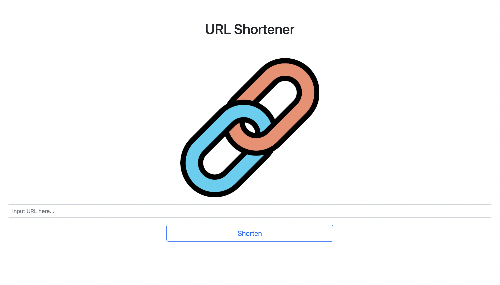

# Short URL

This repository provide a small service to shorten the URL. It is currently run as local host in the local side.

This project is built with Node.js + Express.

## Introduction
1. Home Page Form: The home page features a form where users can input the original URL, such as https://www.google.com. Upon submission, the page will generate a formatted short URL, for example: https://localhost:3000/6y7UP.

2. URL Redirection: Users can enter the generated short URL (https://localhost:3000/6y7UP) in the browser's address bar. The browser will then automatically redirect to the corresponding original website (https://www.google.com).

3. Short URL Format: The generated short URL follows a specific format, consisting of 5 alphanumeric characters. See the example below for visualization (where ... represents the URL of your application):



## Installation 
1. Clone this repository.

``` 
$ git clone https://github.com/candacechou/ShortenURL.git
```

2. source into the directory

```
$ cd URL_shortener
```

3. Install Express via npm

```
URL_shortener/ $  npm i express
```
4. Install Express handler
```
URL_shortener/ $ npm i express-handlebars
```
5. raise the app.js via nodemon

```
URL_shortener/ $  npm run dev 
```

6. to stop :

```
URL_shortener/ $ CTRL+C
```

## Tools

- Node.js
- CSS, HTML
- Javascript
- express.js
- express-handlebars
- Bootstraps